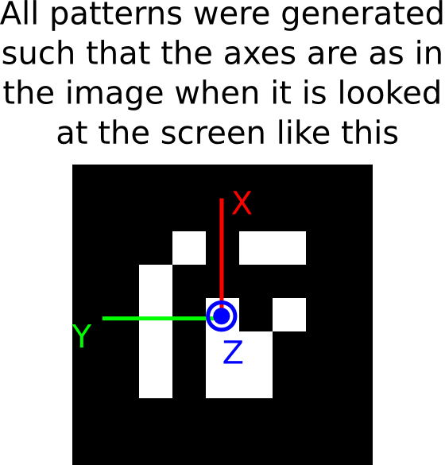
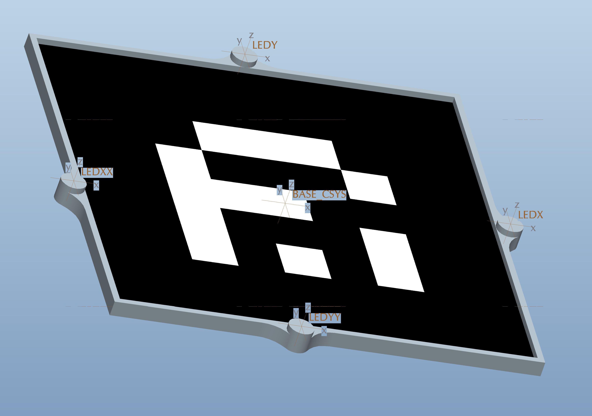
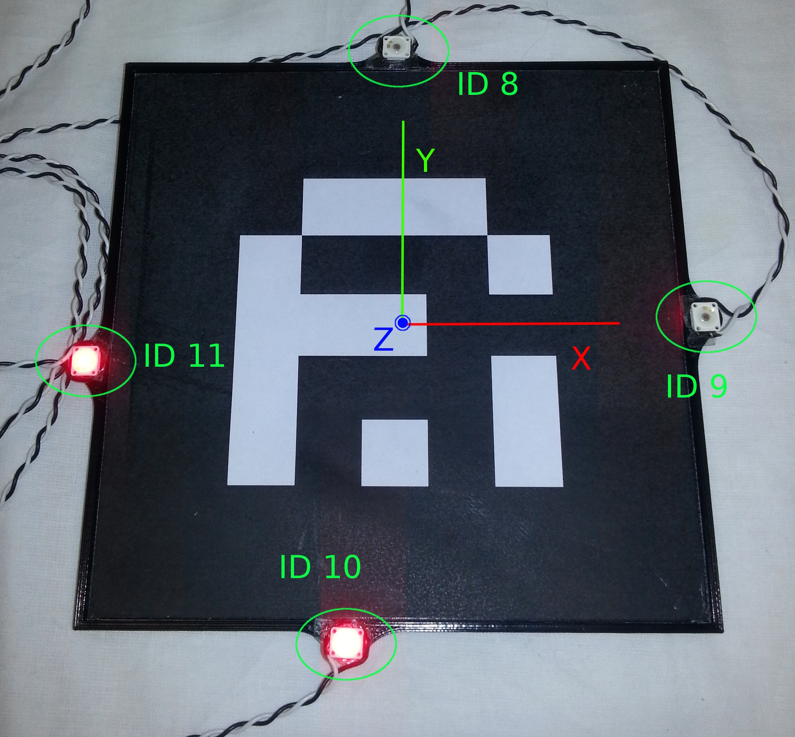

# calibration

A general calibration tool for the equipments in Centro Piaggio.

The hand-eye calibration problem first appeared and got its name from the robotics community, where a camera ("eye") was mounted on the gripper ("hand") of a robot. The cameras was calibrated using a calibration pattern. Then the unknown transformation from the robot coordinate system to the calibration pattern coordinate system as well as the transformation from the camera to the hand ocordinate system need to be estimated simultaneously.

For more details on the problem, check: http://campar.in.tum.de/Chair/HandEyeCalibration

## Dependencies

`sudo apt-get install ros-indigo-ar-track-alvar ros-indigo-ar-track-alvar-msgs ros-indigo-ar-track-alvar-meta`

Mostly, we are using the Asus, but this package can be easily extended to consider other camera types. Thus, for the Asus, you need:

`sudo apt-get install ros-indigo-openni2-launch ros-indigo-openni2-camera`

And depending which of the cases below you are using, you might need the respective packages within.

## KUKA LWR and Asus in-hand

## KUKA LWR and Asus head calibratrion

1. 3D print [this calibrator](resources/3DPrints/asus_kuka_calibrator.stl) (only one arm is required, so print it once)

2. Print any of the two markers `resources/MarkerPrints/KukaLeft_ID20.png` or `resources/MarkerPrints/KukaLeft_ID20.png`, depending on which arm you plan to use for calibration. NOTE: you must scale the print until the image is 15x15cm.

3. Mount the 3D print on the robot such as the hole for the cables coincide with the cables of the KUKA when it is fully extend at home position.

4. Place the marker print on the calibrator piece. Check the `X` and `Y` axes of the marker before placing it, and make `X` coincide with the cables. Consider that the axes are as shown in the image below.   

5. `roslaunch calibration kinect_phase_space_calibration.launch`

6. Check on rviz that the calibrator is correctly being tracked by both systems, check the axes correspond to those of the pattern.

7. When you feel comfortable `rosservice call /calibrate` and don't move the calibrator.

The transformation between the two systems is being published, check the `asus_head_kuka_calibration.launch` the names of the frames being used.

The transformation will be saved into a yaml file inside 'config' directory and will be loaded at every package launch, until another `rosservice call /calibrate` overwrites it.

After calibration is done you can kill the process. The saved calibration file can be broadcasted with `roslaunch calibration asus_head_kuka_broadcaster.launch`

## Asus phase-space calibration

1. 3D print [this calibrator](resources/3DPrints/asus_phasespace_calibrator.stl) (only one arm is required, so print it once)

2. Ensure the ar marker is well centered in the calibrator object. The reference frame of both are coincident to facilitate the reasoning. Check the axes as shown in the image below.  

3. Glue the leds to the calibrator and confirm the LED ids as shown in the image below.  

4. Follow the instructions in the phase space package to track the "calibrator" object. Remember to check that the led ids correspond exactly to the ones mounted on the calibrator.

5. `roslaunch calibration asus_phase_space_calibration.launch`

6. Check on rviz that the calibrator is correctly being tracked by both systems, check the axes correspond to those of the pattern.

7. When you feel comfortable `rosservice call /calibrate` and don't move the calibrator.

The transformation between the two systems is being published, check the `asus_phase_space_calibration.launch` the names of the frames being used.

The transformation will be saved into a yaml file inside 'config' directory and will be loaded at every package launch, until another `rosservice call /calibrate` overwrites it.

After calibration is done you can kill the process. The saved calibration file can be broadcasted with `roslaunch calibration asus_phase_space_broadcaster.launch`
