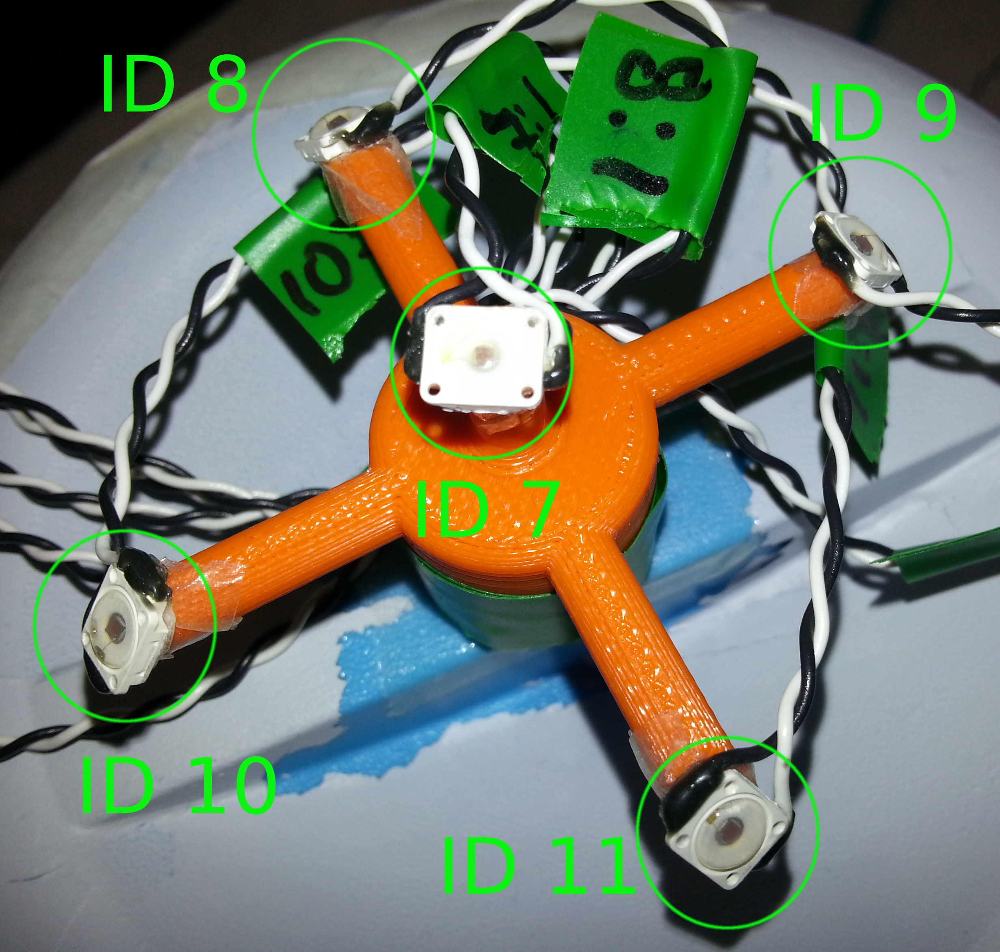

# calibration

A general calibration tool for the equipments in Centro Piaggio. For now, only a simple calibration tool is tested, which consist in finding an unknown frame relation by means of a calibrator being tracked in the frames of concerns. You can find ready setups and instructions below for:
 - Asus head on the [Vito robot](https://github.com/CentroEPiaggio/vito_robot): Finds the relation between a rigidly-fixed-on-torso camera and world using one arm
 - [Asus](http://www.asus.com/Multimedia/Xtion_PRO_LIVE/)/[PhasesSpace](https://github.com/CentroEPiaggio/phase-space): Finds the relation between an Asus and the Phase Space system
 - [Tracker/Object]: Find the relation between a known (you have the 3D model and know excatly where the leds are) object (tracker) attached to an unkonwn object (you might have the 3D model coming from a scan, thus hard to tell an exact position of leds w.r.t. the object frame)

## Asus head on Vito calibratrion

1. Check whether [this calibrator](resources/3DPrints/asus_kuka_calibrator.stl) is already available, otherwise 3D print it (only one arm is required, so print it once)

2. Print any of the two markers depending you use the [Right](resources/MarkerPrints/KukaLeft_ID20.png) or the [Left](resources/MarkerPrints/KukaLeft_ID20.png) arm you use for calibration. NOTE: you must scale the print until the image is 10x10cm, but you need to cut the paper as a 15x15cm square with the image centered.

3. Mount the 3D print on the robot such as the hole for the cables coincide with the cables of the KUKA when it is fully extend at home position. (ToDo: take picture)

4. Place the marker print on the calibrator piece. Check the `X` and `Y` axes of the marker before placing it, and make `X` coincide with the cables. Consider that the axes are as shown in the image below.   

5. Type `roslaunch calibration asus_head_vito_calibration.launch`

6. You should see that the calibrator object is detected and being tracked as an ar marker, and that the robot is configured as in the real robot. Check that the axes correspond to those of the pattern. At this point, both tracker and marker do not necessarily coincide, however, both should move identically.

7. Place the calibrator where you consider the two systems fully track it succesfully, e.g. the marker plane is parallel to the lens. Now type `rosservice call /calibrate` and you should see how both marker and tracker align

8. The transformation between the two systems is saved into a yaml file inside 'config' with a given name and broadcasted. After calibration, you might kill the process, and type `roslaunch calibration asus_head_vito_broadcaster.launch` to add the name space to the calibration parameters.

## Asus/PhaseSpace calibration

1. Check wether [this calibrator](resources/3DPrints/asus_phasespace_calibrator.stl) is already available, otherwise 3D print it

2. Print [this ar marker](esources/MarkerPrints/KinectPhaseSpace_ID60.png). NOTE: you must scale the print until the image is 10x10cm, but you need to cut the paper as a 13.20x13.20cm square with the image centered.

2. Glue [this ar marker](resources/3DPrints/MakerPrints) on [the calibrator](resources/3DPrints/asus_phasespace_calibrator.stl). Ensure the ar marker is well centered in the calibrator object as well as align with the axes of the calibrator as shown in the image below. It is important to note that the calibrator is not symmetric, take a look on the image:   

3. Glue the leds with IDs as in the figure below to the calibrator.  

5. Type`roslaunch calibration asus_phase_space_calibration.launch`

6. You should see that the calibrator object is detected and being tracked by the phase space, and that the ar marker is being detected and tracked by the asus. Check that the axes correspond to those of the pattern. At this point, both tracker and marker do not necessarily coincide, however, both should move identically.

7. Place the calibrator where you consider the two systems fully track it succesfully, e.g. the marker plane is parallel to the lens. Now type `rosservice call /calibrate` and you should see how both marker and tracker align.

8. The transformation between the two systems is saved into a yaml file inside 'config' with a given name and broadcasted. However, after calibration, you might kill the process, and type `roslaunch calibration asus_phase_space_broadcaster.launch` to add the namespace to the calibration parameters.

## PS-Tracker/Object calibration

### Addictional dependencies and setup
  - [pose_estimation_online](https://github.com/CentroEPiaggio/pose_estimation_online), follow setup procedure for this node.
  - [dual_manipulation_shared](https://bitbucket.org/dualmanipulation/shared/overview), just clone it into catkin workspace, no further setup are needed.
  - [asus_scanner_models](https://github.com/pacman-project/pacman-object-database), for object meshes and models.
  - Make sure you also fullfil normal setup and dependencies from calibration package itself.

### Procedure

1. 3D print [this calibratior]() NOTE: find the star stl for printing to update the link

2. Glue the leds with IDs as in the figure below, make sure ID7 is on top of the star, pairs ID8-ID11 and ID9-ID10 are opposite to each other. Finally also make sure ID9 is on the right of ID8 and next to it.   

3. Glue the star on the object you want to track. The star position should be placed so that leds are fully visible by the phase space system and the star doesn't affect the object shape too much when viewed by the Asus rgb-d sensor.

4. Put a table in the room centre and the object with the star attached to it on top of the table. Make sure the only thing on the table
is the object you want to track, if needed hide the phase space equipments (cables, batteries, etc...) from the Asus rgb-d view. when you are satisfied with the layout don't move the table and the object anymore.

5. Open a terminal and type `roslaunch calibration tracker_object_calibration.launch tracked_object:=<name>`, where `<name>` is the object name you want to track, according to the ones available from `asus_scanner_models`. An rviz window will open to help you visualize the procedure.

6. If needed view `scene_filter` parameters and adjust them to fit the table, so only the table and the object are visible by the Asus rgb-d. Usage and addictional informations on `scene_filter` package are visible [here](https://bitbucket.org/Tabjones/scene_filter).

7. Open another terminal and type `rosservice call /pose_estimation_online estimate visualize=true` a procedure for the object pose estimation will start. At the end the procedure (it will take a few seconds) a viewer will open (unless you put visualize=false during service call) picturing the estimation. Make sure the green pointcloud and the red one are visually aligned over each other as best as possible. If unsatisfied repeat this step until you see correct alignement. To help the process it could be useful to change the object position on the table a little bit.

8. Finally to perform the calibration type `rosservice call /calibrate`, calibration correctness can be viewed directly on rviz or by killing the calibration node and by launching `roslaunch calibration tracker_object_broadcaster.launch`

## Dependencies

`sudo apt-get install ros-indigo-ar-track-alvar ros-indigo-ar-track-alvar-msgs ros-indigo-ar-track-alvar-meta`

Mostly, we are using the Asus, but this package can be easily extended to consider other camera types. Thus, for the Asus, you need:

`sudo apt-get install ros-indigo-openni2-launch ros-indigo-openni2-camera`

And depending which of the cases below you are using, you might need the respective packages within.
